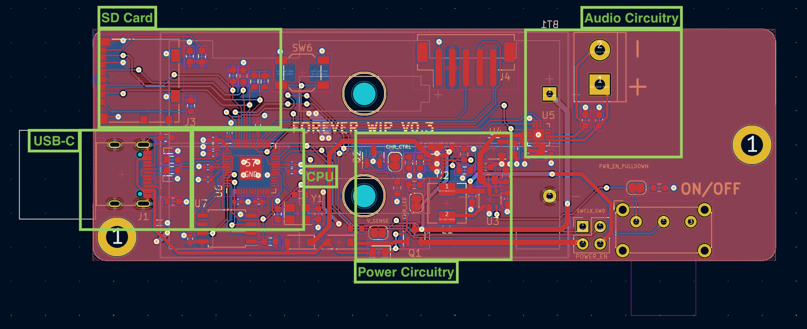
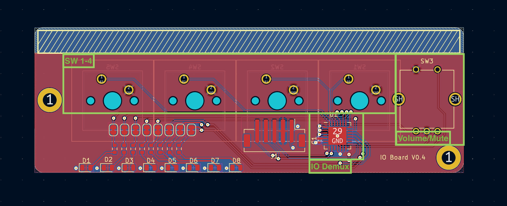

# PCB

KiCAD (6.0) schematic and PCB files.

There are technically two KiCAD projects here. One for the "main" board and one for the
IO board. 

Supporting multiple PCBs in one KiCAD project is kinda janky right now. So it was decided 
to use different projects. This allows us to iterate separately on these boards. It also seems to be
easier for fab houses to process and manufacture, without dramatically increasing the price. 

We might have to eventually reconsider using two separate projects for scale and cost purposes, but for dev work this seems to work fine.

## Version:

[VERSION 0.3] 
SHA: e7d5517

## Preparing boards for manufacturing

TODO
